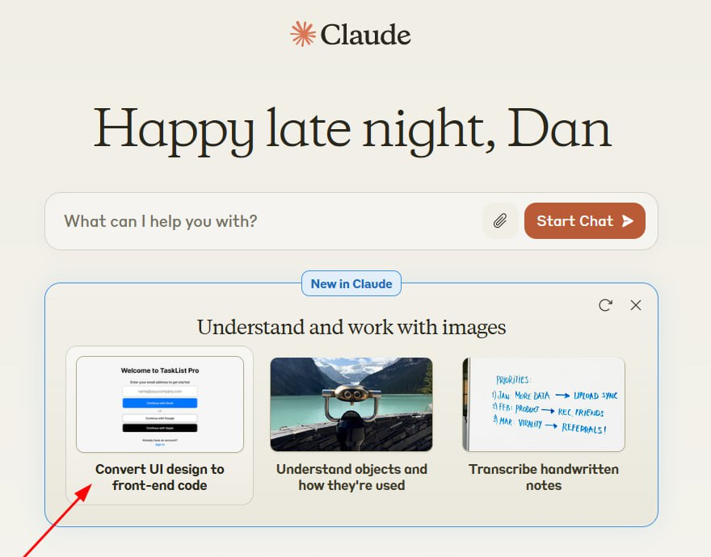

<!--
date: 2024-03-05T01:41:21
photo: 

-->

The company [Anthropic](https://claude.ai/chats)  updated its models to version 3 - now they can recognize images.

Among the cases is the conversion of a simple design into html code upon request "Convert this design into a react component using tailwind css" - everything is ok on VUE too