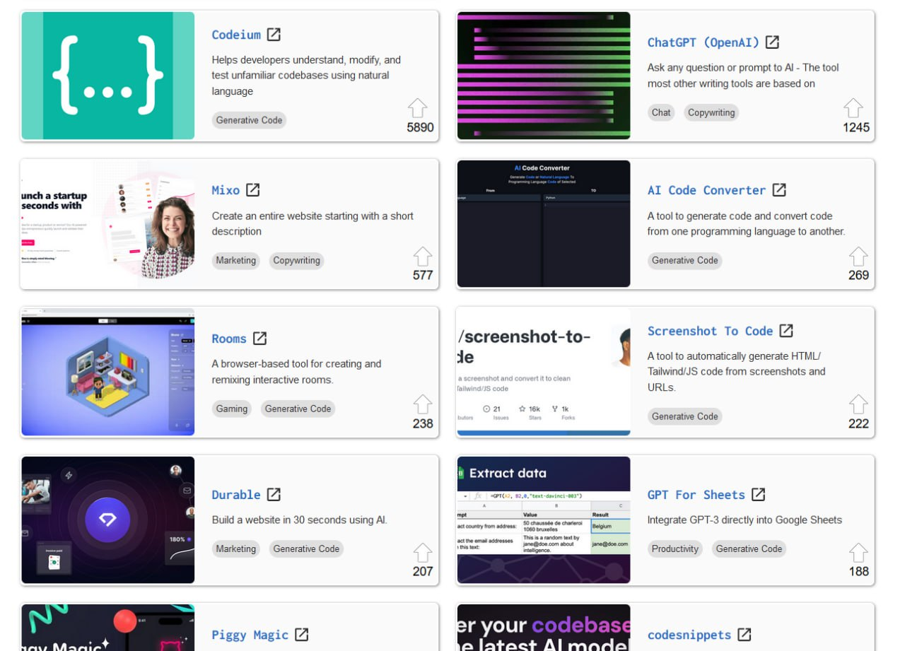

<!--
date: 2024-03-14T12:56:57
photo: 

-->

There are several catalog sites where people add and vote for tools that use artificial intelligence. We are interested in the "code generation" section.

On [futuretools.io](https://www.futuretools.io/?tags-n5zn=generative-code), Codeium (5890) and ChatGPT (1245) are now in first place according to user ratings.

_I want to make a separate video about Codeium._