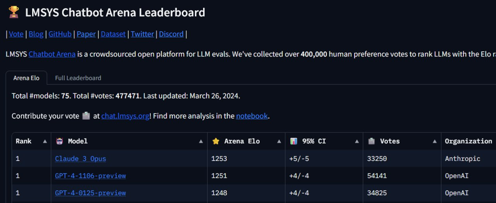

<!--
date: 2024-03-28T02:58:33
photo: 

-->

Chatbot Arena [project, the](https://chat.lmsys.org/?arena)GPT-4**model has always been in first place. (**news [)

It's interesting that if at the beginning the GPT-3.5 model caused admiration, now in comparison with new models, it looks very weak and gives weak results.](https://arstechnica.com/information-technology/2024/03/the-king-is-dead-claude-3-surpasses-gpt-4-on-chatbot-arena-for-the-first-time/)We are waiting for some changes from OpenAI soon._Stability AI introduced, and on olllama, they added the_