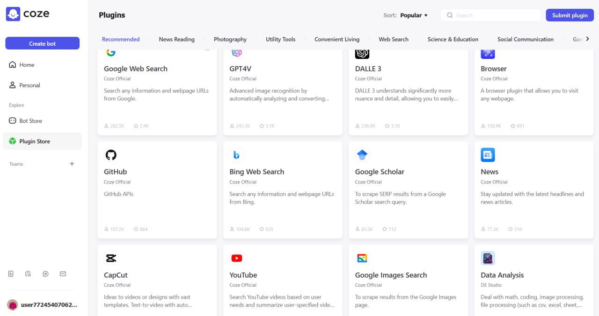

<!--
date: 2024-04-05T21:14:37
photo: 

-->

Found a startup [Coze](https://www.coze.com/)  — a significantly expanded clone of the functionality of **GPTs**, where

1) there is no binding of the chat only to the OpenAI website - access to the bot is possible from Discord, Telegram, Slack (business bots), Facebook and Instagram Messenger, LINE (popular in Asia), Reddit (bots for specialized communities), Cici, Lark.

2) it is possible to choose GPT 3.5, where the limit is 500 messages/day

3) [catalog of already configured plugins](https://www.coze.com/store/plugin)  where there are GitHub, StackOverFlow, Code Interpreter, [Data Analysis](https://www.coze.com/store/plugin/7329367912139997186?from=explore_card) 

4) multi-agent mode - explanation in the video 
[https://www.youtube.com/watch?v=l00ZB2ZaVO0](https://www.youtube.com/watch?v=l00ZB2ZaVO0)

⌨️ In the [bot store](https://www.coze.com/store/bot)  I found [Code Companion from icheQ](https://www.coze.com/store/bot/7332362537742368774?panel=1&bid=MDQEENGG04PIlXcm7-Pk2tsfKnYEHtKSJKKhfh0M7ZjrGvYRCAnokBXsyKyP8POPcX3bTQQA&share=1&from=others)  - now 11.7K users. There is also access to it from telegram _Minus - this is a startup now without a financial model.__Access only from the USA, the telegram bot answered me after 3 minutes and in general everything works very slowly.__Limits__GPT-4 100-50 messages/day._ 

chat chaos [https://t.me/+m7bX9D4WjV4yMzgx](https://t.me/+m7bX9D4WjV4yMzgx)