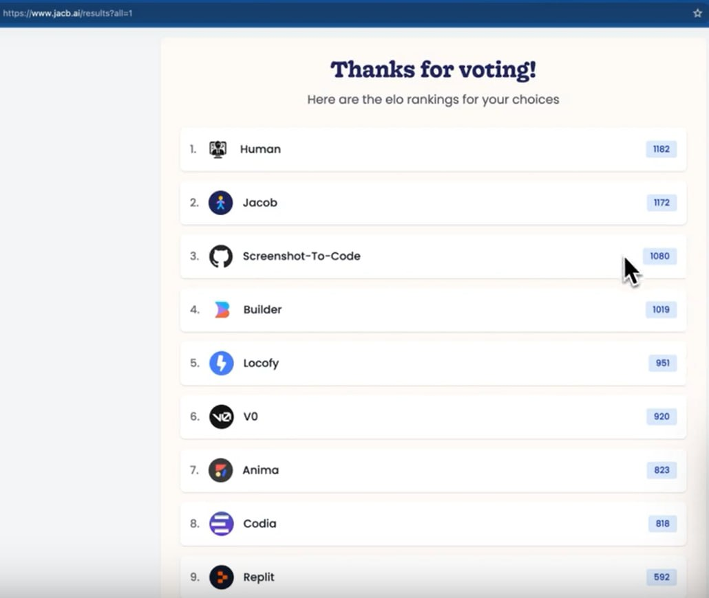

<!--
date: 2024-05-01T00:08:39
photo: 

-->

The screenshot shows the results of a "blind" comparison by people of two options for converting design into code: various available tools and a live person
[
JACoB (Just Another Coding Bot)](https://www.jacb.ai/)  - it looks like an AI assistant made under the influence of Devin, which converts designs into working code 💻, understands the repository 📂

🔄 Integrates with GitHub repositories and Figma designs
🤝 Smart dialogue with a person through review and code changes
(will be) 🔓 Open source to extend functionality
👥 Adapted to the workflow of an existing team

Interestingly, similar to the new version of GitHub Copilot, they primarily focus on determining the list of **tasks**  for the AI agent by a human

_I couldn't check, on my GitHub account they write "Try signing in with a different account."_