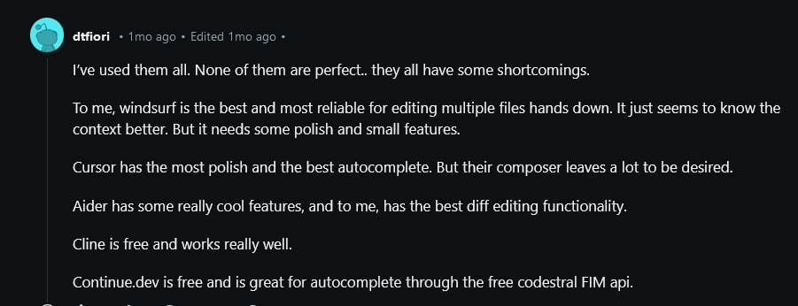

<!--
date: 2024-12-29T13:51:23
photo: 

-->

[reddit](https://www.reddit.com/r/ChatGPTCoding/comments/1gwnpqs/comment/lyaln1x/) 

None of them (AI assistants) are perfect... they all have some drawbacks.

For me [Windsurf](https://codeium.com/windsurf)  is the best and most reliable for editing **multiple**  files, no doubt. It just seems to understand the context better. But it needs some refinement and some features.

[Cursor](https://www.cursor.com/)  is the most thought out and has the best autocomplete. But their composer leaves much to be desired.

[Aider](https://aider.chat/)  has some really cool features, and in my opinion, has the best diff editing functionality.

[Cline](https://github.com/cline/cline)  is free (there is an option) and works quite well.

[Continue.dev](Continue.dev)  is free and great for autocomplete through the free codestral FIM API.