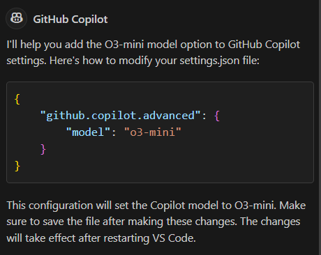

In **MS VS Code** 1.97 
Copilot is already built into the program and is not installed as an extension. Voice input is still a separate extension (VS Code Speech).

The o3-mini model has been added for all plans, even the free one, which has 50 requests/month ([news](https://github.blog/changelog/2025-02-06-openai-o3-mini-is-now-available-in-github-copilot-free/)). However, it didn't appear automatically for me; I had to figure out the settings:

In the preview, there's a feature to set context from a Markdown file; here, you need to create it in `.github/copilot-instructions.md`

Also, people have discovered that you will not be able to name your variables "*sexHere*" and "*sexThere*," as Copilot intentionally stops working with code that contains predefined forbidden words ([discussion](https://github.com/orgs/community/discussions/72603)).

#githubcopilot
