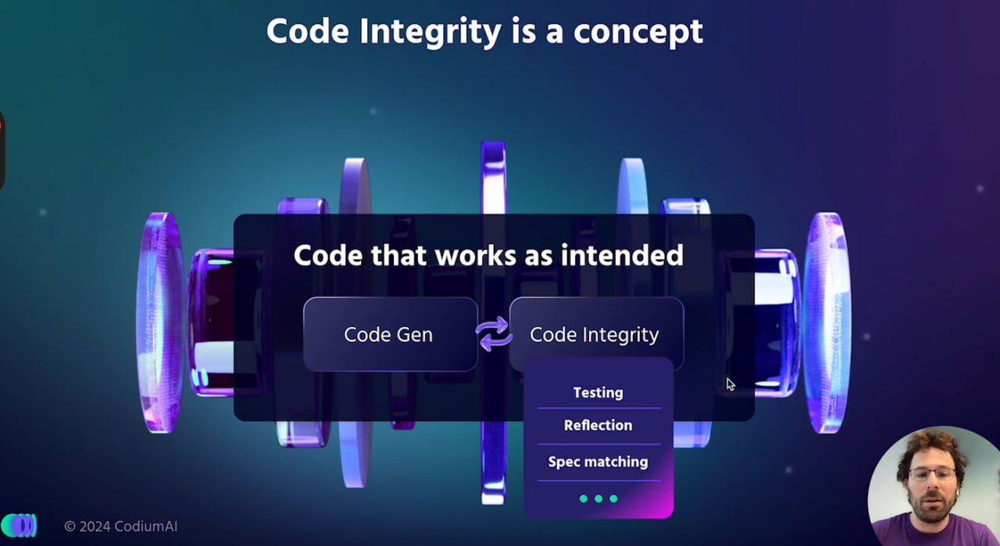

<!--
date: 2025-02-02T23:23:04.030Z
photo: 

-->

 [https://www.codium.ai/products/alpha-codium](https://www.codium.ai/products/alpha-codium) від CodiumAI

CodiumAI, на відміну від інших систем штучного інтелекту для роботи з кодом, вибрали і зайняли вузьку нішу - покращення якості коду (генерація тестів, аналіз безпеки та продуктивності).

Тепер їх наступний крок - система AlphaCodium, яка може автоматично перевіряти якість згенерованого коду. Тим самим це схоже як працюють GAN. Вона  [https://github.com/Codium-ai/AlphaCodium](https://github.com/Codium-ai/AlphaCodium) на OpenAI API ключі, та вирішує проблеми сформульовані у  [https://huggingface.co/datasets/deepmind/code_contests](https://huggingface.co/datasets/deepmind/code_contests) форматі JSON.

[https://www.youtube.com/watch?v=AOqnJLBYon4](https://www.youtube.com/watch?v=AOqnJLBYon4)

 /  [https://www.codium.ai/blog/alphacodium-state-of-the-art-code-generation-for-code-contests/](https://www.codium.ai/blog/alphacodium-state-of-the-art-code-generation-for-code-contests/)
Від “Інженерії запитів” до "Інженерії потоку"