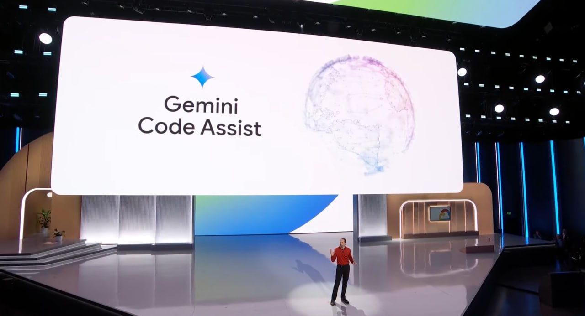

<!--
date: 2024-04-11T21:19:35
photo: 

-->

На конференції **Cloud Next**  Google показали свого асистента для програмування (на слайді це був плагін VSCode) - основний акцент зробили на тому, що в Gemeni 1.5 таке контекстне вікно, якого немає у жодного конкурента - на 1М токенів.

Gemini Code Assist доступний для тестування безкоштовно до 11 липня 2024 року.