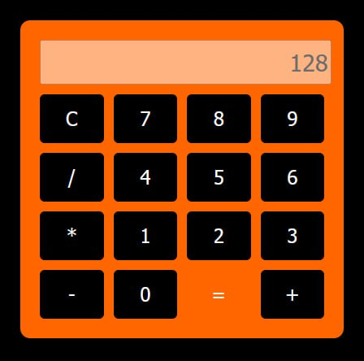

<!--
date: 2024-12-17T00:12:03
photo: 

-->

**Windsurf** [https://codeium.com/windsurf](https://codeium.com/windsurf) 

як конкурент Cursor (при запуску ще й може з нього забрати налаштування). У базі це все той же VSC, тому інтерфейс сильно вивчати не треба.

Треба акканут на codeium це мінус. Моделі три - за гроші GPT 4o та Claude 3.5 Sonnet, безкоштовно Cascade Base (це схоже Llama 3 70B). Я шукаю що буде працювати на моїх API-ключах, і тут немає такого варіанту, на жаль.

Калькулятор html мені створило, але кнопка "=" чомусь в середіні.

Автор [відео](https://www.youtube.com/watch?v=T323mpYjgbI) 

 наводить аналогію з автомобілем 2015 року - "Tartan Prancer" (Honda з Албанії), щоб проілюструвати, що Windsurf створює враження чудового інструменту, але в реальності він недопрацьований. Він порівнює це з колегами на роботі, які постійно все переробляють. ШІ тут постійно переписує код багатьох файлів, через що доводиться перевіряти все постійно, а це схоже на початок спочатку.