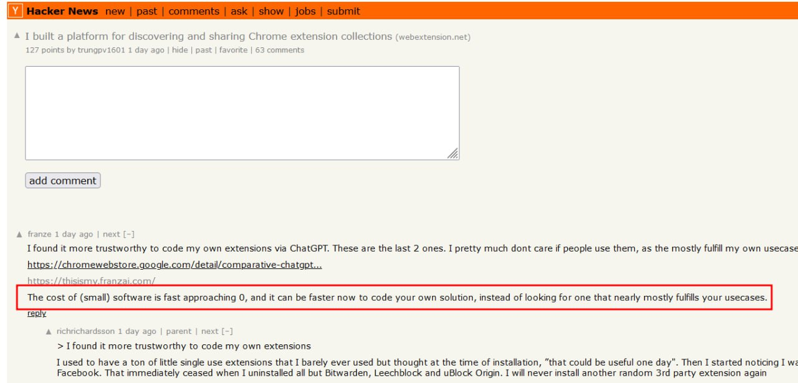

<!--
date: 2024-12-25T00:40:41
photo: 

-->

Цікава думка  [тут у коментарі](https://news.ycombinator.com/item?id=42492753):

_З розвитком штучного інтелекту в програмуванні ціна на (просте) програмне забезпечення прямує до нуля! Іноді, набагато швидше самому "накодити" потрібну тобі функцію чи утиліту, ніж шукати щось готове._

Раніше розробка навіть невеликої програми вимагала значних зусиль і часу. Тепер же, з допомогою інструментів на базі ШІ процес створення власного софту стає швидким й простим. 

Тобто до того часу коли все стане ШІ, а софт зникне буде щось перехідне й це коли хто вміє буде робити собі свої программи, а не використовувати чужі.