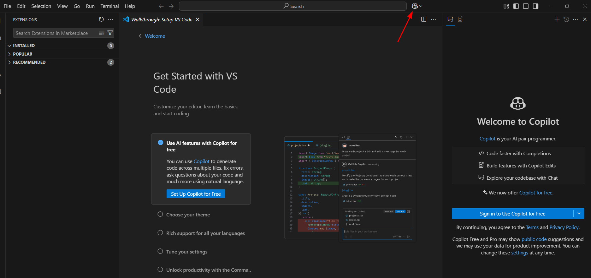

у **MS VS Code** 1.97 
Copilot вже вбудований у програму, а не встановлюється як розширення. Голосове введення все ще залишається окремим розширенням (VS Code Speech).

Додали модель o3-mini для всіх планів, навіть до безкоштовного де 50 запитів/місяц ([новина](https://github.blog/changelog/2025-02-06-openai-o3-mini-is-now-available-in-github-copilot-free/)).  Але в мене не з'явилася сама по собі, довелося розбиратися з налаштуваннями:

У попередньому перегляді працює функція завдання контексту з файлу Markdown, тут його треба створити у `.github/copilot-instructions.md`.

Також люди відкрили, що ви не зможете називати свої змінні "*сексТуди*" та "*сексСюди*", оскільки Copilot навмисно припиняє працювати з кодом, який містить заздалегідь визначені заборонені слова ([обговорення](https://github.com/orgs/community/discussions/72603)).

#githubcopilot
